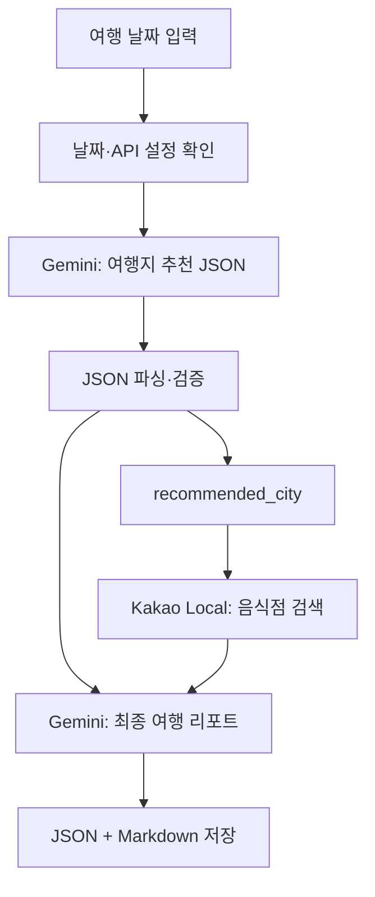

# 국내 여행 추천 프로그램

여행 날짜를 입력하면 **여행지 추천 → 맛집 검색 → 여행 리포트 생성**을 수행하는 Python CLI 프로그램입니다. Google Gemini와 Kakao Local API를 연결해 추천 정보와 장소 데이터를 하나의 리포트로 정리합니다.

## 프로그램 개요

| 입력 | 처리 | 출력 |
| --- | --- | --- |
| 여행 날짜 `YYYY-MM-DD` | Gemini 여행지 추천 + Kakao 음식점 검색 + Gemini 리포트 생성 | 결과 데이터 JSON, 여행 리포트 Markdown |

- **실행 환경:** Python 3.11 이상 권장 (과제 기준: Python 3.10 이상)
- **사용 라이브러리:** `argparse`, `requests`, `python-dotenv`
- **추천 범위:** 국내 지역 1곳, 음식점 후보 최대 5곳
- **날씨·행사:** 일반적인 계절 날씨와 행사 후보를 제공하며, 실제 예보·확정 일정은 별도로 확인

## 전체 처리 흐름



| 단계 | 주요 처리 | 다음 단계로 전달하는 데이터 |
| --- | --- | --- |
| 1. 입력 확인 | 날짜 형식·실제 날짜와 필수 설정 확인 | 여행 날짜 |
| 2. 여행지 추천 | Gemini 응답을 JSON으로 파싱하고 검증 | 지역, 날씨, 행사 후보, 추천 이유 |
| 3. 음식점 검색 | 추천 지역으로 Kakao Local 검색 | 이름, 주소, 분류, 지도 링크, 좌표 |
| 4. 리포트 생성 | 추천 JSON과 음식점 목록을 Gemini에 전달 | Markdown 여행 리포트 |
| 5. 결과 저장 | 결과 데이터와 리포트 저장 | `results/`의 파일 경로 |

## API 요청과 응답

API 요청은 **URL, HTTP 메서드, 헤더, 입력 데이터**로 구성됩니다. 응답에는 **상태 코드, 헤더, 본문**이 포함됩니다. 프로그램은 상태 코드로 성공·실패를 구분하고, 응답 JSON에서 필요한 데이터를 추출합니다.

| 항목 | Gemini | Kakao Local |
| --- | --- | --- |
| 역할 | 추천과 리포트 생성 | 기존 장소 정보 조회 |
| HTTP 메서드 | **POST** | **GET** |
| 입력 | JSON 본문에 프롬프트·생성 설정 전달 | 쿼리 파라미터에 검색어·카테고리·개수 전달 |
| 인증 헤더 | `x-goog-api-key` | `Authorization: KakaoAK <키>` |
| 응답 활용 | 생성 텍스트 추출 | `documents`에서 장소 목록 추출 |
| 구현 파일 | `travel/llm.py` | `travel/places.py` |

이 프로그램에서 GET은 장소 조회에, POST는 프롬프트를 전달하여 새로운 텍스트 생성 작업을 요청하는 데 사용합니다.

## JSON을 통한 API 연결

첫 번째 Gemini 호출은 다음 네 필드를 가진 JSON을 생성합니다. 아래 내용은 데이터 구조를 보여주는 예시입니다.

```json
{
  "recommended_city": "강릉",
  "weather": "가을에는 비교적 선선하며 해안 바람에 대비하는 것이 좋습니다.",
  "events": ["가을 지역 문화 행사 후보 — 해당 연도 일정 확인 필요"],
  "reason": "해안 산책과 지역 문화 공간을 함께 즐길 수 있습니다. 선선한 시기에 여유로운 하루 여행을 계획하기 좋습니다."
}
```

| 필드 | 타입 | 조건 |
| --- | --- | --- |
| `recommended_city` | string | 국내 추천 지역 1곳 |
| `weather` | string | 해당 시기의 일반적 날씨 |
| `events` | array of string | 행사·축제 후보 1~3개 |
| `reason` | string | 추천 근거 2~4문장 요청 |

`json.loads()`로 응답을 파싱한 뒤 필수 키, 타입, 빈 문자열과 행사 개수를 검증합니다. 국내 지역 여부와 추천 이유의 문장 수는 프롬프트로 요청하며 별도의 코드 검증은 수행하지 않습니다.

검증된 지역명은 장소 검색의 입력으로 연결됩니다.

```python
# travel/pipeline.py
search_restaurants(recommendation["recommended_city"], settings)
```

```python
# travel/places.py
params = {
    "query": f"{city} 맛집",
    "category_group_code": "FD6",
    "size": 5
}
```

JSON을 사용하면 자유로운 문장에서 지역명을 추측할 필요 없이 정해진 필드에서 값을 추출할 수 있습니다. LLM 응답을 검증하는 과정은 잘못된 데이터가 다음 API로 전달되는 것을 줄입니다.

## 음식점 검색과 리포트 구성

Kakao 응답의 장소 데이터를 다음 형식으로 정리합니다.

| 저장 필드 | 내용 |
| --- | --- |
| `name` | 음식점 이름 |
| `address` | 도로명 주소, 없으면 지번 주소 |
| `category` | 장소 분류 |
| `url` | 지도 링크 |
| `x`, `y` | 숫자형 경도·위도, 사용할 수 없으면 `null` |

이름·주소가 없는 항목은 제외하고 중복 항목은 제거합니다. 최대 5곳을 검색하므로 최종 목록은 검색 결과에 따라 더 적을 수 있습니다. 검색 목록은 평점이나 품질을 검증한 순위가 아닙니다.

추천 JSON과 음식점 목록을 함께 Gemini에 전달하여 다음 항목을 포함한 Markdown 리포트를 생성합니다.

- 추천 지역과 이유
- 날씨 요약
- 행사·축제 후보
- 맛집 리스트
- 오전·오후·저녁의 1일 일정
- `errors` 오류 요약

생성 후 필수 섹션과 일정 항목을 보완하고, 맛집 섹션은 실제 검색 목록으로 구성합니다. 목록이 비어 있으면 **데이터 없음**으로 표시합니다.

## 오류 처리

API 호출과 파싱 오류는 `try-except`로 처리하고 내부 `errors` 목록에 요약을 기록합니다.

| 상황 | 처리 방식 |
| --- | --- |
| API 키·모델 ID 미설정 | 외부 API 호출 전 종료, 설정 방법 안내 |
| 인증 실패 — 401 / 403 | 키, 인증 헤더, 이용 권한·설정 확인 안내 |
| 사용량 제한 — 429 | 쿼터 오류 기록, 사용량 확인 안내 |
| 네트워크·시간 초과 | 연결 오류·시간 초과 처리 |
| 추천 JSON 파싱·검증 실패 | 문제를 담은 수정 프롬프트로 **1회 재요청** |
| 추천 재요청도 실패 | 오류를 포함한 대체 리포트 저장 |
| 장소 API 실패 | 빈 음식점 목록으로 **리포트 생성 계속 진행** |
| 장소 검색 정상 0건 | 맛집을 **데이터 없음**으로 표시하고 계속 진행 |
| 최종 Gemini 호출 실패 | 확보한 추천·음식점 데이터로 대체 리포트 저장 |

추천 형식 오류의 재요청은 처음 요청까지 합쳐 최대 2번입니다. 인증·쿼터 등 모든 오류를 자동으로 재시도하지는 않습니다.

정상 검색 0건은 API 실패와 구분하여 `search_status: "empty"`로 저장합니다. 오류가 없으면 `errors`는 빈 배열이고, 리포트의 errors 섹션에는 `없음`을 표시합니다.

## API 키 관리

API 키는 코드에 직접 작성하지 않고 **환경변수 또는 `.env`**에서 읽습니다.

| 관리 원칙 | 이유 |
| --- | --- |
| 코드와 비밀 값 분리 | 협업·저장소 공유 시 키 공개 사고 예방 |
| 설정 파일·환경변수 사용 | 코드 수정 없이 키 교체 가능 |
| 실제 키·인증 헤더를 제출 자료에서 제외 | 무단 사용으로 인한 과금·쿼터 소진 예방 |

`.env`는 Git에서 제외하고 `.env.example`에는 설정 항목만 공유합니다. README·로그·결과 파일에도 실제 키를 포함하지 않습니다.

## 설치 및 설정

### macOS / Linux

```bash
git clone https://github.com/gaori29-52/A1-2.git
cd A1-2
python3 -m venv .venv
source .venv/bin/activate
python -m pip install -r requirements.txt
cp .env.example .env
```

### Windows PowerShell

```powershell
git clone https://github.com/gaori29-52/A1-2.git
cd A1-2
py -3 -m venv .venv
.\.venv\Scripts\Activate.ps1
python -m pip install -r requirements.txt
Copy-Item .env.example .env
```

기존 `.env`가 있다면 복사 단계는 생략합니다. 프로젝트 루트의 `.env`에 다음 세 항목을 설정합니다. 아래 값은 실제 키가 아닌 자리표시자입니다.

```dotenv
GEMINI_API_KEY=YOUR_GEMINI_API_KEY
GEMINI_MODEL=YOUR_AVAILABLE_MODEL_ID
KAKAO_REST_API_KEY=YOUR_KAKAO_REST_API_KEY
```

Gemini 키와 사용 가능한 모델 ID는 [Google AI Studio](https://aistudio.google.com/)에서, Kakao REST API 키와 이용 설정은 [Kakao Developers](https://developers.kakao.com/)에서 확인합니다.

현재 터미널 세션에 환경변수를 설정할 수도 있습니다.

```bash
# macOS / Linux
export GEMINI_API_KEY="YOUR_GEMINI_API_KEY"
export GEMINI_MODEL="YOUR_AVAILABLE_MODEL_ID"
export KAKAO_REST_API_KEY="YOUR_KAKAO_REST_API_KEY"
```

```powershell
# Windows PowerShell
$env:GEMINI_API_KEY="YOUR_GEMINI_API_KEY"
$env:GEMINI_MODEL="YOUR_AVAILABLE_MODEL_ID"
$env:KAKAO_REST_API_KEY="YOUR_KAKAO_REST_API_KEY"
```

이미 설정된 환경변수가 `.env`보다 우선합니다. 키 두 개와 모델 ID는 모두 필수 설정입니다.

## 실행 방법

프로젝트 루트에서 실행합니다.

```bash
python main.py -date "2026-10-15"
python main.py --help
```

`argparse`로 필수 옵션 `-date "YYYY-MM-DD"`를 처리합니다. `--date`도 지원하며, 형식 오류나 실제로 존재하지 않는 날짜는 사용법과 오류를 출력한 뒤 종료합니다.

```bash
# 입력 오류 예시
python main.py -date "2026/10/15"
python main.py -date "2026-02-30"
```

실행 중에는 입력 확인·추천·검색·리포트 생성·저장의 진행 로그를 표시합니다. 저장 완료 후 `JSON:`과 `REPORT:` 뒤에 결과 경로를 안내합니다.

| 종료 코드 | 의미 |
| --- | --- |
| 0 | 추천 정보와 최종 생성 리포트 저장 완료. 장소 검색 실패·0건이어도 리포트 생성에 성공하면 0일 수 있음 |
| 1 | 설정 오류, 추천 실패, 대체 리포트 또는 처리된 저장 오류 |
| 2 | 옵션 누락·날짜 오류 등 CLI 입력 오류 |

## 결과물 확인

결과는 프로젝트의 `results/` 폴더에 JSON과 Markdown 한 쌍으로 저장합니다. 파일명에는 한국 표준시 기준 실행 날짜·시각과 입력한 여행 날짜를 포함합니다.

```text
results/
├── <실행날짜>_<시각>_<마이크로초>_<여행날짜>.json
└── <실행날짜>_<시각>_<마이크로초>_<여행날짜>.md
```

| 파일 | 주요 내용 |
| --- | --- |
| JSON | `recommendation`: 1차 추천, `restaurants`: 음식점 목록, `errors`: 오류 요약 |
| Markdown | 추천 지역·이유, 날씨, 행사, 맛집, 1일 일정, errors |

JSON에는 여행 날짜·실행 시각·API 제공자·처리 상태도 포함됩니다. 저장하는 데이터는 파싱된 추천과 정리된 장소 목록이며, HTTP 응답 전체를 그대로 보관하는 형식은 아닙니다.

추천 실패 시 `recommendation`은 `null`일 수 있고, 대체 리포트는 `report_status: "fallback"`으로 구분합니다. 정상 결과 제출 시에는 실제 API로 실행하여 추천 데이터와 최종 리포트를 확인해야 합니다.

`results/`는 Git에서 제외됩니다. 제출할 JSON·Markdown은 비밀 값이 없는지 확인한 뒤 별도로 첨부하거나 `examples/`에 복사하여 공유합니다.

## 요구사항과 구현

| 요구사항 | 구현 파일 |
| --- | --- |
| CLI·필수 날짜 옵션 | `travel/cli.py` |
| 날짜·추천 JSON 검증 | `travel/validation.py` |
| 추천 스키마·리포트 프롬프트 | `travel/prompts.py` |
| Gemini 호출·추천 재요청 | `travel/llm.py` |
| Kakao 장소 검색·필드 정리 | `travel/places.py` |
| API 간 데이터 연결·오류 누적 | `travel/pipeline.py` |
| 리포트 필수 항목·빈 맛집·errors | `travel/report.py` |
| 환경변수·.env 설정 확인 | `travel/config.py` |
| JSON·Markdown 파일 저장 | `travel/storage.py` |
| 공통 오류 기록 | `travel/errors.py` |

선택 보너스인 복수 지역 추천과 결과 캐싱은 현재 구현 범위에 포함하지 않았습니다.

## 프로젝트 구조

```text
A1-2/
├── main.py
├── README.md
├── .env.example
├── .gitignore
├── requirements.txt
├── requirements-dev.txt
├── travel/
│   ├── __init__.py
│   ├── cli.py
│   ├── config.py
│   ├── validation.py
│   ├── prompts.py
│   ├── llm.py
│   ├── places.py
│   ├── pipeline.py
│   ├── report.py
│   ├── storage.py
│   └── errors.py
├── tests/
│   ├── test_cli.py
│   ├── test_validation.py
│   ├── test_places.py
│   └── test_pipeline.py
└── results/                 # 실행 시 생성
```

## 테스트

```bash
python -m pip install -r requirements-dev.txt
python -m pytest
```

테스트는 외부 API를 mock으로 대체하여 날짜·JSON 검증, 재요청, 장소 결과 처리, 오류 이후 진행과 리포트 구성을 확인합니다. 실제 키·권한·모델 이용 가능 여부와 결과 파일은 별도의 실제 API 실행으로 확인합니다.
